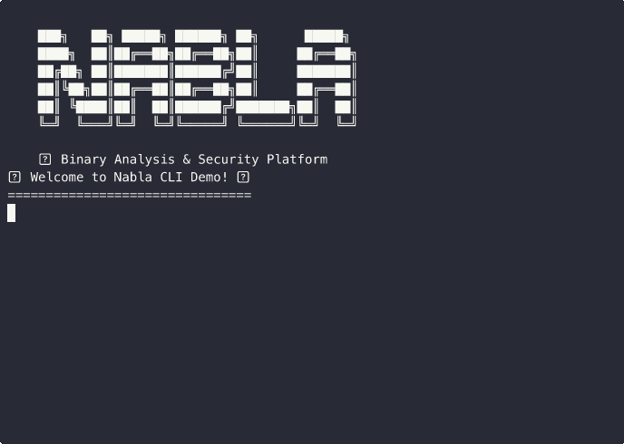

<div align="center">


<br/>

<!-- Badges -->
[](https://opensource.org/licenses/MIT)


[](https://discord.gg/YOUR_INVITE_CODE)


<h1>Nabla – An OSS SAST/SCA API for calculating your SSCS gradients</h1>
<a href="https://app.aikido.dev/audit-report/external/G521LxDZEcKvh8XO6zdBP6gW/request" target="_blank">
    
    
</a>
</div>



> The nabla is used in vector calculus as part of three distinct differential operators: the gradient (∇), the divergence (∇⋅), and the curl (∇×)

Nabla is a binary-first, fair-source, secure API for SAST/SCA tasks — designed to analyze, monitor, and validate the binaries used in your tools, applications, or infrastructure.

Built in Rust and deployable anywhere via Docker, Nabla helps modern teams build resilient CI/CD pipelines by generating attestations, SBOMs, CVE reports, and more — all from binaries alone.

## 🧐 Why Nabla?

We built this tool because as ecosystems like Rust and Wasm grow, it's becoming more and more common for developers to use third-party binaries in their code and infrastructure. 

This introduces risk into the software supply chain, including:

    - Shadow dependencies and bundled binaries
    - Missing or unverifiable SBOMs
    - Unknown vulnerabilities (CVEs)
    - Inability to produce attestations or verify signatures

Nabla acts like a firewall for your binary inputs — providing deep binary analysis, vulnerability detection, attestation, and SBOMs in a clean, simple API.

## ✨ Features

- **🔍 Binary Analysis**:  ELF, PE, Mach-O, and WASM parsing via `goblin`
- **🧾 SBOM Generation**: CycloneDX format generation from extracted packages
- **🚨 CVE Lookup**: Detect vulnerabilities in known packages and binary patterns
- **✍️ Attestation**: Sigstore-compatible predicate output ready for signing
- **⛓️‍💥 Diffing**: Compare two binaries and view differences in content and structure
- **⚙️ REST API**: JSON-first API built on Axum, ready for CI/CD pipelines

## 🔌 CLI Commands

All commands require authentication unless otherwise specified. Set your JWT token using `nabla auth --set-jwt <token>`.

### Binary Analysis

Analyze a binary file to extract metadata, packages, and generate SBOMs.

```bash
nabla binary analyze <FILE>
```

**Example:**
```bash
nabla binary analyze ./my_binary
```

> **REST equivalent:** `POST /binary/analyze`

### Binary Comparison

Compare two binaries to identify differences in packages, symbols, and metadata.

```bash
nabla diff <FILE1> <FILE2>
```

**Example:**
```bash
nabla diff old_binary new_binary
```

> **REST equivalent:** `POST /binary/diff`

### Generate Attestations (Requires license)

Create Sigstore-compatible attestations for binaries with cryptographic signing.

```bash
nabla binary attest --signing-key <SIGNING_KEY> <FILE>
```

**Example:**
```bash
nabla binary attest --signing-key my_signing_key ./my_binary
```

> **REST equivalent:** `POST /binary/attest`

### CVE Scanning

Scan binaries for known vulnerabilities in detected packages.

```bash
nabla binary check-cves <FILE>
```

**Example:**
```bash
nabla binary check-cves ./my_binary
```

> **REST equivalent:** `POST /binary/check-cves`

### AI-Powered Analysis (Requires license)

Generate SBOMs and perform AI-powered binary analysis through natural language.

```bash
nabla chat <MESSAGE>
```

**Example:**
```bash
nabla chat "Generate a CycloneDX SBOM for this binary"
```

> **REST equivalent:** `POST /binary/chat`

## Authentication & Configuration

### Authentication

Set your JWT token for API access:

```bash
nabla auth --set-jwt <JWT_TOKEN>
```

Check authentication status:

```bash
nabla auth status
```

Upgrade authentication:

```bash
nabla auth upgrade
```

### Configuration Management

View all configuration settings:

```bash
nabla config list
```

Get a specific configuration value:

```bash
nabla config get <KEY>
```

Set a configuration value:

```bash
nabla config set <KEY> <VALUE>
```

Set the base URL for the API:

```bash
nabla config set-base-url <URL>
```

### Server Mode

Run Nabla in server mode (legacy):

```bash
nabla --server --port 8080
```

Or using the server subcommand:

```bash
nabla server
```

## Setup

### Prerequisites

- Rust 1.82+

### Environment Variables

Copy `.env.example` to `.env` and configure:

```bash
PORT=8080
FIPS_MODE=false          # Enable FIPS 140-2 compliance
FIPS_VALIDATION=false    # Enable FIPS validation checks
```

### Getting Started

Clone the repo:

```bash
git clone https://github.com/jdbohrman/nabla.git
cd nabla
```

Setup your environment:

```bash
cp .env.example .env
```

Edit .env:

```env
PORT=8080
FIPS_MODE=false
FIPS_VALIDATION=false
```

Run locally:

```bash
cargo run
```

## FIPS 140-2 Compliance

Nabla supports FIPS 140-3 compliance mode for enterprise deployments:

### FIPS Mode Features
- **FIPS 140-3 Approved Algorithms**: SHA-256, SHA-512, HMAC-SHA256, AES-256-GCM
- **FIPS Validation**: Runtime validation of cryptographic operations
- **Compliance Reporting**: Health check endpoint reports detailed FIPS status
- **FIPS-Compliant TLS**: Uses only FIPS-approved cipher suites
- **FIPS-Compliant RNG**: Uses operating system secure random number generation
- **JWT/HMAC Compliance**: Uses FIPS-approved HMAC-SHA256 for token validation

### Environment Variables
```bash
FIPS_MODE=true           # Enable FIPS 140-2 compliance
FIPS_VALIDATION=true     # Enable FIPS validation checks
```

### FIPS Implementation Details

#### Cryptographic Algorithms
- **Hashing**: SHA-256, SHA-512 (FIPS mode) vs Blake3 (standard mode)
- **HMAC**: HMAC-SHA256 for JWT token validation
- **Random Generation**: OS secure RNG (FIPS) vs standard RNG (standard)
- **TLS Cipher Suites**: FIPS-approved suites only in FIPS mode

#### Binary Analysis
- **Hash Generation**: Uses configurable crypto provider
- **Metadata**: Includes FIPS status and algorithm information
- **Consistency**: All cryptographic operations respect FIPS mode

#### HTTP Client
- **TLS Configuration**: FIPS-compliant cipher suites when enabled
- **Certificate Validation**: Enhanced security in FIPS mode
- **Connection Security**: Uses rustls with FIPS-approved settings

## License

This project is licensed under the MIT License - see the LICENSE file for details.

Want a license key for the enterprise features? [Chat up the Atelier Logos team](https://cal.com/team/atelier-logos/nabla-intro) and get a 14-day trial